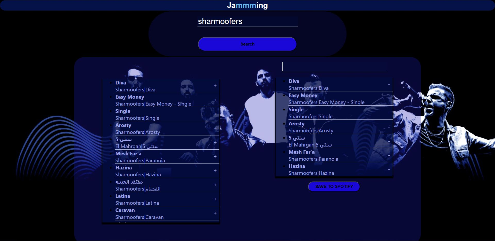

# Jammming - A Spotify Playlist Manager

## Description

Jammming is a web application developed as part of the Codecademy Fullstack Career Path. The main purpose of this project is to create a Spotify playlist manager that allows users to search for tracks on Spotify and add them to a personalized playlist, which can then be saved and accessed within their Spotify account.

**Motivation:** The motivation behind building Jammming was to gain hands-on experience with React.js, API integration (specifically with Spotify), and to create a practical and fun application that solves a common problem for music enthusiasts.

**Problem:** Many Spotify users often discover new tracks they like but might forget to add them to a playlist right away. Jammming addresses this issue by providing a simple interface to search for songs and add them to a new or existing playlist in their Spotify account, making music organization effortless.

**What I Learned:** Throughout the development of Jammming, I learned how to work with React components, manage state and props, utilize APIs, handle user authentication, and implement the OAuth 2.0 authorization flow with Spotify.

## Features

- **Search Tracks:** Users can search for tracks by entering keywords, and Jammming fetches matching tracks from Spotify's vast music library.

- **Create Playlist:** Users have the option to create a new playlist with a custom name, where they can add their favorite tracks.

- **Add to Playlist:** Once tracks are found, users can add them to the playlist they created, and they can also remove tracks from the playlist if needed.

- **Save to Spotify:** After customizing the playlist, users can save it directly to their Spotify account, making it available on all their devices.

## Demo screenshot

## How to Use

1. Clone the repository to your computer:
     clone https://github.com/abdelrahmanelbakly/jammming
2. Navigate to the project directory:
    cd jammming
3. Install project dependencies using npm or yarn:
    npm install
    or
    yarn install
4. Create a Spotify Developer account and create a new application to obtain the **Client ID**.
5. In the project's `src/App` store your **Client ID**.
6. Start the development server:
    npm start
    or
    yarn start
7. Open your web browser and go to `http://localhost:3000` to access Jammming.
8. Log in to your Spotify account to grant access to Jammming and start managing your playlists.

## Technologies

Jammming was built using the following technologies and frameworks:

- **React.js:** Used to create a dynamic and responsive user interface.

- **Spotify Web API:** Integrated to fetch track data from the Spotify music library and interact with the user's Spotify account.

- **OAuth 2.0:** Implemented to handle user authentication and authorization with Spotify.

- **JavaScript (ES6+):** The primary programming language used for the application's logic.

- **HTML/CSS:** Used for structuring the webpage and styling the components.

- **npm:** Package managers to install and manage project dependencies.

---

_Thank you for checking out the Jammming project! If you have any questions or feedback, feel free to contact me at abdelrahman.abdelaziz9@gmail.com. Happy jamming!_

